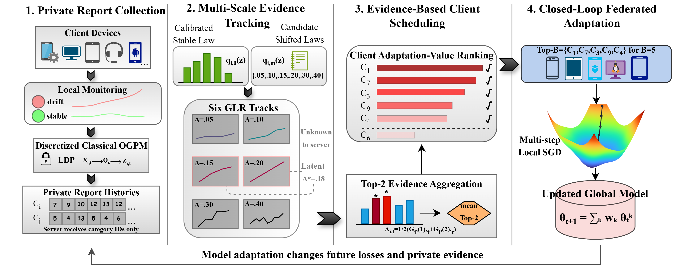

# MC-PrivGLR

Code and paper-result release for:

**Drift or LDP Noise? Temporal Scheduling for Federated Adaptation**

MC-PrivGLR addresses budgeted client scheduling in federated adaptation when only a small subset of clients undergoes persistent distribution drift and client monitoring signals are protected by local differential privacy (LDP).

The method distinguishes persistent drift evidence from randomized LDP perturbations by accumulating private evidence over time, evaluating multiple candidate drift scales, and prioritizing clients under a fixed adaptation budget.

## Framework

*MC-PrivGLR converts locally private monitoring reports into temporally accumulated multi-scale evidence, ranks clients under a fixed adaptation budget, and closes the loop through federated model adaptation.*

[Vector PDF](assets/mcprivglr_framework.pdf)

## Method Overview

MC-PrivGLR contains the following components:

1. **Event-level private monitoring.** Each client monitoring-window observation is privatized through the exact Optimal Generalized Privacy Mechanism (OGPM) channel.
2. **Client-specific calibration.** Private reports are interpreted relative to each client's calibrated pre-change behavior.
3. **Multi-chart private GLR.** Parallel reflected likelihood-ratio charts monitor a fixed public grid of candidate positive shifts.
4. **Temporal evidence accumulation.** Persistent evidence is accumulated across monitoring windows to distinguish sustained drift from isolated LDP randomness.
5. **Top-2 scale fusion.** The two strongest accumulated charts are fused into the client scheduling score.
6. **Budgeted adaptation.** At each scheduling step, the clients with the largest MC-PrivGLR scores are selected for local adaptation and weighted aggregation.

## Repository Contents

    MC-PrivGLR-release/
    ├── code/
    │   ├── run_v15_main.py
    │   ├── run_v15_cinic10.py
    │   ├── run_v24_recent_baselines.py
    │   ├── run_v24_recent_baselines_cinic10.py
    │   ├── run_ablation.py
    │   ├── run_sensitivity.py
    │   ├── v15_official_baseline_adapters.py
    │   ├── v24_strong_baseline_adapters.py
    │   └── closed_form_mechanism.py
    ├── baselines/
    │   ├── FedGCS/
    │   └── HiCS-FL/
    ├── baselines_2025_2026/
    │   ├── FL-Client-Sampling/
    │   └── FEROMA/
    ├── data/
    │   └── README.md
    ├── results/
    │   ├── README.md
    │   └── paper/
    ├── requirements.txt
    ├── .gitmodules
    └── README.md

## Environment

The repository uses Python 3.11. The Python dependencies are pinned in `requirements.txt`.

Tested dependency set:

- Python 3.11.9
- NumPy 2.4.6
- pandas 3.0.5
- SciPy 1.17.1
- scikit-learn 1.9.1
- PyTorch 2.14.0
- torchvision 0.29.0
- Pillow 12.3.0
- datasets 5.0.1
- PyArrow 25.0.1

A CUDA-capable GPU is recommended for full-scale experiments. The released CSV result files can be inspected without a GPU.

## Installation

Clone the repository together with its Git submodules:

    git clone --recurse-submodules <repository-url>
    cd MC-PrivGLR-release

If the repository was cloned without `--recurse-submodules`, initialize the submodules with:

    git submodule update --init --recursive

### Windows PowerShell

Create and activate a Python 3.11 environment:

    py -3.11 -m venv .venv
    .\.venv\Scripts\Activate.ps1
    python -m pip install --upgrade pip
    python -m pip install -r requirements.txt

Check dependency consistency:

    python -m pip check

### Linux

Create and activate a Python 3.11 environment:

    python3.11 -m venv .venv
    source .venv/bin/activate
    python -m pip install --upgrade pip
    python -m pip install -r requirements.txt
    python -m pip check

For GPU execution, install a PyTorch build compatible with the local CUDA driver if the default package is unsuitable.

## Dataset Preparation

Raw datasets, generated dataset caches, and local checkpoint caches are not included.

See `data/README.md` for dataset preparation instructions.

The experiments use four datasets:

- CIFAR-10
- CIFAR-100
- CINIC-10
- FEMNIST

CIFAR-10 and CIFAR-100 can be downloaded through torchvision. CINIC-10 and FEMNIST require preparation according to the paths accepted by the experiment scripts.

Dataset roots and output paths stored in the released JSON configuration files record the original experiment locations. Replace those machine-specific paths when rerunning experiments on another system.

## Entry Scripts

| Script | Purpose |
| --- | --- |
| `code/run_v15_main.py` | Main comparison with established client-selection baselines on CIFAR-10, CIFAR-100, and FEMNIST |
| `code/run_v15_cinic10.py` | Main V15 comparison on CINIC-10 |
| `code/run_v24_recent_baselines.py` | Comparison with recent baselines on CIFAR-10, CIFAR-100, and FEMNIST |
| `code/run_v24_recent_baselines_cinic10.py` | Recent-baseline comparison on CINIC-10 |
| `code/run_ablation.py` | Temporal-accumulation and scale-fusion ablations |
| `code/run_sensitivity.py` | Budget, scale-count, and fixed-shift sensitivity experiments |

Display the complete command-line interface of an entry script with:

    python code/run_v15_main.py --help

## Quick Code Validation

The entry scripts provide a lightweight validation mode for the privacy mechanism, likelihood-ratio implementation, aggregation logic, and controlled ablation variants.

### Windows PowerShell

    $Python = ".\.venv\Scripts\python.exe"
    & $Python code\run_v15_main.py --self_test
    & $Python code\run_v15_cinic10.py --self_test
    & $Python code\run_v24_recent_baselines.py --self_test
    & $Python code\run_v24_recent_baselines_cinic10.py --self_test
    & $Python code\run_ablation.py --self_test
    & $Python code\run_sensitivity.py --self_test

### Linux

    python code/run_v15_main.py --self_test
    python code/run_v15_cinic10.py --self_test
    python code/run_v24_recent_baselines.py --self_test
    python code/run_v24_recent_baselines_cinic10.py --self_test
    python code/run_ablation.py --self_test
    python code/run_sensitivity.py --self_test

A successful lightweight validation does not replace a full experimental rerun.

## Running the Main Experiments

The following command illustrates the main V15 interface on CIFAR-10:

    python code/run_v15_main.py --root data --dataset cifar10 --seed 5001 --num_stream_seeds 5 --num_clients 100 --horizon 200 --change_time 30 --calib_end 30 --async_window 5 --ramp_windows 5 --changed_fractions 0.05 0.10 --primary_fraction 0.05 --budget_b 5 --local_steps 2 --warmup_rounds 120 --warmup_clients_per_round 20 --warmup_local_steps 5 --epsilons 0.5 1.0 2.0 --primary_epsilon 1.0 --report_levels 16 --eval_every 10 --bootstrap_runs 1000 --policy_subset paper --out_dir outputs/v15/cifar10

For CINIC-10, use the dedicated entry point:

    python code/run_v15_cinic10.py --root data --seed 5001 --num_stream_seeds 5 --policy_subset paper --out_dir outputs/v15/cinic10

For the recent-baseline comparison:

    python code/run_v24_recent_baselines.py --root data --dataset cifar10 --seed 5001 --num_stream_seeds 5 --policy_subset recent --out_dir outputs/v24/cifar10

For the controlled component ablations:

    python code/run_ablation.py --root data --dataset cifar10 --seed 6301 --num_stream_seeds 5 --policy_subset core_ablation --out_dir outputs/ablation/cifar10

For sensitivity experiments:

    python code/run_sensitivity.py --root data --dataset cifar10 --seed 7001 --num_stream_seeds 3 --out_dir outputs/sensitivity/cifar10

Before a complete rerun, inspect the corresponding JSON configuration under `results/paper/`. These JSON files preserve the settings used to generate the released paper results, although machine-specific dataset and checkpoint paths must be replaced.

## Experimental Seeds

The released per-seed results use the following seed sets:

| Experiment | Datasets or settings | Seeds |
| --- | --- | --- |
| Main V15 comparison | CIFAR-10, CIFAR-100, CINIC-10, FEMNIST | 5001, 5002, 5003, 5004, 5005 |
| Main V24 comparison | CIFAR-10, CIFAR-100, CINIC-10, FEMNIST | 5001, 5002, 5003, 5004, 5005 |
| Temporal ablation | CIFAR-10 and CIFAR-100 | 6301, 6302, 6303, 6304, 6305 |
| Temporal ablation | FEMNIST | 6301, 6302, 6303 |
| Top-2 versus Top-1 fusion | CIFAR-10 | 6301, 6302, 6303 |
| Sensitivity experiments | CIFAR-10 | 7001, 7002, 7003 |

The data-partition seed is fixed at 2026 across the released configurations.

## Released Paper Results

The `results/paper/` directory contains only metrics used in the paper.

Included metrics are:

- drifting-client loss;
- drifting-client accuracy;
- identity AUPRC;
- recall at the adaptation budget;
- temporal loss trajectories;
- the reported temporal-accumulation ablation;
- the reported Top-2 versus Top-1 fusion ablation;
- the reported sensitivity results.

See `results/README.md` for the exact mapping between paper tables, paper figures, CSV files, datasets, methods, and seed sets.

## Table 2 Ablation Definition

The scale-fusion component in Table 2 compares:

- **Top-2:** the mean of the two strongest accumulated private GLR tracks;
- **Top-1:** the strongest accumulated private GLR track only.

This is a fusion ablation. It is not a comparison between six scales and a single-scale detector.

The single-scale diagnostic is represented separately by the fixed-shift sensitivity experiments.

## Baseline Provenance

| Component | Upstream repository | Recorded version |
| --- | --- | --- |
| HiCS-FL-related implementation | `https://github.com/CityChan/HiCS-FL` | `f1dc34e8e3f48665fe03786932318433fd9704fb` |
| FedGCS / GenerativeFL | `https://github.com/zhiyuan-ning/GenerativeFL` | `785773b2a6675048aa3ab2ac7aaf0324b802f368` |
| Adaptive Client Sampling | `https://github.com/boxinz17/FL-Client-Sampling` | `8d12ac39f10d8ac90a7dfb245c1a77f288ba39c4` |
| Optimal-GPM | `https://github.com/ZhengYeah/Optimal-GPM` | `e38cacb4ae557c5a0eb08413b96fdacdbd807a12` |
| FEROMA | `https://github.com/dariofenoglio98/FEROMA` | Official source snapshot used for channel adaptation; integrity recorded by SHA-256 |

For FEROMA, we use the official upstream source as the implementation basis and retain the corresponding source snapshot in this repository. Its released contents are recorded in `baselines_2025_2026/FEROMA/SHA256SUMS.txt`. For a controlled comparison, the FEROMA client profile signal is adapted to the common OGPM reporting and fixed-budget scheduling interface used in this study. The original FEROMA method and source remain attributed to their upstream authors.

Third-party source directories retain their upstream authorship and licensing terms.

## Reproducibility Scope

This release provides:

- executable experiment entry points;
- pinned Python dependencies;
- source-backed baseline adapters;
- fixed baseline source versions where available;
- per-seed metrics used in the paper;
- experiment configuration snapshots;
- explicit seed sets;
- dataset preparation instructions.

This release does not include:

- raw datasets;
- generated dataset caches;
- model checkpoints;
- intermediate diagnostics not used in the paper;
- metrics that were not compared under the paper's stated seed protocol;
- plotting or table-generation scripts.

## Citation

Citation information will be added after publication.

## Contact

For questions about the implementation or released results, please use the repository issue tracker.

